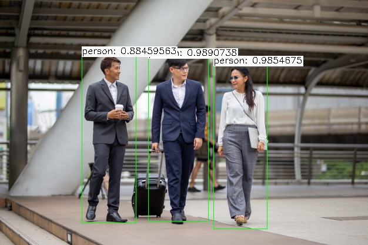

# A project using OpenCV (computer vision) to recognize the speed of a person in a video stream

## The method with the determination of centroids will be used

- The scheme for determining the speed of a person for a given video file is shown in the diagram


- The architecture of the software prototype is shown in the diagram


- First experiment - identification of the persons


- Second experiment - identifying people in the video and saving each frame to disk.
An example of the processed file is located [this](tests_video_detection/test_frames.avi).

- Third experiment - the prototype of the software tool processes the video and dynamically
finds the speed of the given objects. 
An example of the processed file is located [this](tests_video_detection/output.avi).

## Installation

This version of the project was developed on ubuntu 18.04

The installation involves downloading the project and building a docker image via the ```Dockerfile```

## Usage

- ```git clone https://github.com/xxxFilosoFxxx/Speed_determination_with_opencv.git```
- ```cd Speed_determination_with_opencv```
- ```docker build -t speed_detection .```

You can use one mount for a shared folder with processed videos and videos for processing:

- ```docker run --name speed_detection -v "`pwd`/data_user:/home/data_user" -e VIDEO=/home/data_user/video.mp4 speed_detection```

You can use two different mount for the shared folder with processed videos 
and the shared folder with video for processing:

- ```docker run -v "`pwd`/data_user:/home/data_user" -v "`pwd`/for_search_speed:/home/for_search_speed" -e VIDEO=/home/for_search_speed/video.mp4 speed_detection```

It is also possible to use 2 environment variables:
 
- Recognition percentage -> ```PERCENT```

- Camera tilt angle -> ```TILT```

## Testing

To be continued 
