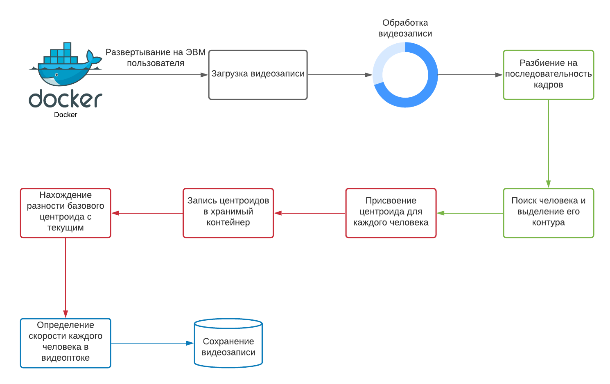
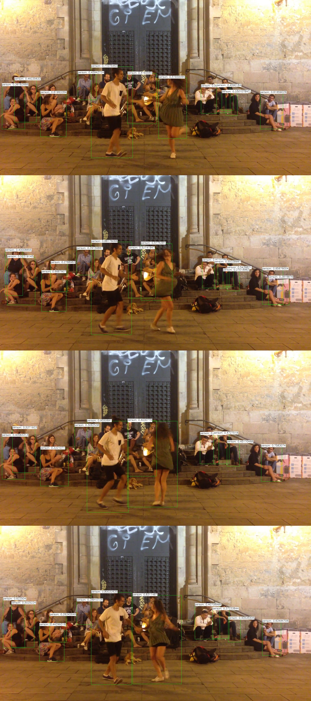

# A project using OpenCV (computer vision) to recognize the speed of a person in a video stream

### The method with the determination of centroids will be used

- The whole work plan is presented in the diagram

- First experiment - identification of the persons

- Second experiment - identifying people in the video and saving each frame to disk

