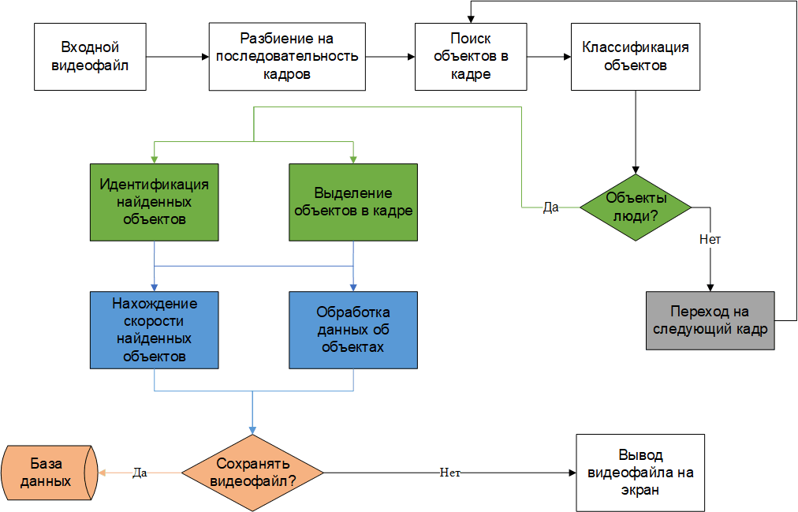

# A project using OpenCV (computer vision) to recognize the speed of a person in a video stream

## The method with the determination of centroids will be used

- The architecture of the software prototype is shown in the diagram


- First experiment - identification of the persons


- Second experiment - identifying people in the video and saving each frame to disk.
An example of the processed file is located [this](video_detection_tests/test_frames.avi).

- Third experiment - the prototype of the software tool processes the video and dynamically
finds the speed of the given objects. 
An example of the processed file is located [this](video_detection_tests/output:01-02-2021_05:34.avi).

## Installation

This version of the project was developed on ubuntu 18.04

The installation involves downloading the project and building a docker image via the ```Dockerfile```

## Usage

- ```git clone https://github.com/xxxFilosoFxxx/Speed_determination_with_opencv.git```
- ```cd Speed_determination_with_opencv```
- ```docker build -t speed_detection .```

If you cannot use pre-prepared videos, then use the ```wget``` utility to download videos 
from the Internet:

- ```mkdir data_user | wget -P "`pwd`/data_user" "YOUR PATH"```

You can use one mount for a shared folder with processed videos and videos for processing: 

- ```docker run --rm -v "`pwd`"/data_user:/home/data_user -e VIDEO=/home/data_user/video.mp4 speed_detection```

You can use two different mount for the shared folder with processed videos 
and the shared folder with video for processing:

- ```docker run --rm -v "`pwd`"/data_user:/home/data_user -v "`pwd`"/for_search_speed:/home/for_search_speed -e VIDEO=/home/for_search_speed/video.mp4 speed_detection```

It is also possible to use 2 environment variables:
 
- Recognition percentage -> ```PERCENT```

## Testing

Run all tests with coverage by running (venv must be activated):

- ```coverage run -m unittest```

```
Name                                Stmts   Miss  Cover
-------------------------------------------------------
src/detection_frame.py                156      1    99%
src/idtracker/centroid_tracker.py      63      0   100%
src/idtracker/trackable_object.py       5      0   100%
src/search_speed.py                    39      0   100%
-------------------------------------------------------
TOTAL                                 263      1    99%
```

For detailed report run:

- coverage report
- coverage html

## Code inspection

For src and tests: ```pylint src tests```

- ```Your code has been rated at 10.00/10```
